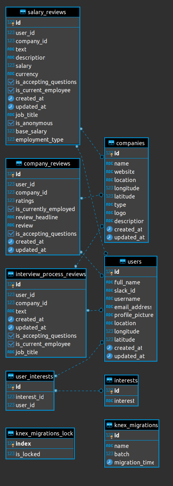

# LambdaDoor API

[](https://travis-ci.com/Labs-EU4/lambda-door-server)
[](https://coveralls.io/github/Labs-EU4/lambda-door-server?branch=develop)

### About

The one-stop portal for Lambda graduates looking for company information in the quest for a job.

### Features

- View and post interview reviews
- View and post salary reviews
- View and post work culture reviews
- In-app chat with other reviewers
- Email notification for unread chats


### Application Links

### [Product Vision Document](https://www.notion.so/EU4-Lambda-Door-11340785bab24a1c8ec3e5fcaec72e8f)

### [API Link](https://lambdadoor-labseu4.herokuapp.com/)

### [Trello board](https://trello.com/b/EQoZOK3D/lambda-door-eu4)

## Team

|                                               **[Colin Toft](http://colintoft.dev/)**                                                |                                     **[Olamide Oredola](https://github.com/ola-dola)**                                      |                                          **[Evans Ibok](http://evansibok.com)**                                          |                                    **[Rodrigo Graça](https://portfolio.rodrigograca.com/)**                                    |
| :----------------------------------------------------------------------------------------------------------------------------------: | :-------------------------------------------------------------------------------------------------------------------------: | :----------------------------------------------------------------------------------------------------------------------: | :----------------------------------------------------------------------------------------------------------------------------: |
|                                                          Backend Developer                                                         |                                                     Backend Developer                                                     |                                                    Backend Developer                                                   |                                                       Backend Developer                                                      |
|       [](https://github.com/cappers86)       |   [](https://github.com/ola-dola)   | [](https://github.com/evansibok) | [](https://github.com/rodrigograca31)  |
|                        [ ](https://github.com/cappers86)                        |                    [ ](https://github.com/ola-dola)                    |                  [ ](https://github.com/evansibok)                  |                  [ ](https://github.com/rodrigograca31)                   |
| [  ](https://www.linkedin.com/in/colin-toft-41975518a) | [  ](https://www.linkedin.com/in/ola-oredola) |  [  ](https://linkedin.com/in/evansibok)   | [  ](https://www.linkedin.com/in/rodrigograca31) |

|                                      **[Alexander Oguejiofor](https://github.com/kip-guile)**                                       |
| :---------------------------------------------------------------------------------------------------------------------------------: |
|                                                              Team Lead                                                              |
|      [  ](https://github.com/kip-guile)       |
|                       [ ](https://github.com/kip-guile)                        |
| [  ](https://www.linkedin.com/in/alexanderoguejiofor) |


### NPM Scripts

To get the server running locally:

- Clone this repo
- **npm install** to install all required dependencies
- **npm run server** to start the local server
- **npm run test** to start server using testing environment
- **npm run migrate** to migrate the tables
- **npm run seed** to seed the tables
- **npm run rollback** to rollback all tables
- **npm run email** to notify users of unread chats

## Environment Variables

In order for the app to function correctly, the user must set up their own environment variables.

Create a .env file that includes the following:

- PORT: The port the server will start on.
- DATABASE_URL: The PostgreSQL database url.
- TESTING_DB: Test PostgreSQL database url.
- ACCESS_TOKEN_SECRET: A string to use as JWT salt.
- EMAIL_PASSWORD: Password for nodemailer email.
- FIREBASE_PRIVATE_KEY_BASE64: Firebase Private PGP Key encoded in base64
- FIREBASE_PRIVATE_KEY_PRODUCTION: Firebase Private PGP Key - Production

## Technologies Used

`JAVASCRIPT`, `NODE.js`, `EXPRESS.js`, `PostgreSql`, `KNEX`, `JSONWEBTOKEN`, `FIREBASE`, `NODEMAILER`, `COVERALLS`, `SENTRY`, `TRAVIS CI`, `HEROKU`, `CRON SCHEDULER`.

## Supporting Packages

Linter

- [ESLint](https://eslint.org/) - The pluggable linting utility for JavaScript and JSX

Test Tools

- [Jest](https://jestjs.io/) - Jest is a delightful JavaScript Testing Framework with a focus on simplicity.
- [Supertest](https://github.com/visionmedia/supertest)

# API Documentation

## Database Model



The API endpoints for the server is on Heroku and can be found [here.](https://lambdadoor-labseu4.herokuapp.com/)

## USERS

### User Routes

| Method | Endpoint            | Access Control | Description                            |
| ------ | ------------------- | -------------- | -------------------------------------- |
| POST   | `/users/`           | all users      | Adds a new user if user doesn't exist. |
| GET    | `/users/:id`        | all users      | Returns info for a user.               |
| PATCH  | `/users/:id`        | all users      | Edits information for a user.          |
| GET    | `/users/:id/logout` | all users      | Logs out a user by deleting cookies.   |

---

```javascript
{
  id int [pk, increment]
  full_name varchar
  username varchar
  email_address varchar
  password varchar
  is_employed varchar
  is_email_verified boolean
  is_admin boolean [default: false]
  profile_picture varchar
  created_at timestamp
}
```

## Actions

### Add a new user [POST]

**URL**: _https://lambdadoor-labseu4.herokuapp.com/users_

**Returns**: An object containing the user credentials.

Input

```javascript
{
 "slack_id": "slack_id",
 "name": "name",
 "email_address": "email_address",
 "img_72": "image_url"
}
```

```javascript
{
    "id": 16,
    "full_name": "name",
    "slack_id": "slack_id",
    "username": "name",
    "email_address": "email_address",
    "profile_picture": "image_url",
    "location": null,
    "longitude": null,
    "latitude": null,
    "created_at": null,
    "updated_at": null
}
```

### Edit User[PATCH]

**URL**: _https://lambdadoor-labseu4.herokuapp.com/users/16_

**Returns**: An array containing an object which holds the users credentials.

Input

```javascript
{
 "location": "earth"
}
```

Returns

```javascript
[
  {
    id: 16,
    full_name: 'name',
    slack_id: 'slack_id',
    username: 'name',
    email_address: 'email_address',
    profile_picture: 'image_url',
    location: 'earth',
    longitude: null,
    latitude: null,
    created_at: null,
    updated_at: null,
  },
];
```

### Get a user [GET]

**URL**: _https://lambdadoor-labseu4.herokuapp.com/users/16_

**Returns**: An object with the user details

Returns

```javascript
{
    "id": 16,
    "full_name": "name",
    "slack_id": "slack_id",
    "username": "name",
    "email_address": "email_address",
    "profile_picture": "image_url",
    "location": "earth",
    "longitude": null,
    "latitude": null,
    "created_at": null,
    "updated_at": null
}
```

## INTEREST

### Interest Routes

| Method | Endpoint               | Access Control | Description                                      |
| ------ | ---------------------- | -------------- | ------------------------------------------------ |
| POST   | `/interests/`          | all users      | Adds an interest to a users list of interests.   |
| DELETE | `/interests/`          | all users      | Returns a message after successful deletion.     |
| GET    | `/interests/`          | all users      | Returns an array of all interest in the DB.      |
| GET    | `/interests/:id/`      | all users      | returns an object of a chosen interest           |
| GET    | `/interests/ui/:id/`   | all users      | returns an object of a user interest with the id |
| GET    | `/interests/user/:id/` | all users      | returns an array of all interest of the user     |

---

### Get all interests [GET]

**URL**: _https://lambdadoor-labseu4.herokuapp.com/interests_

**Returns**: An Array with interest listed in the database

Returns

```javascript
[
  {
    id: 1,
    interest: 'AI Engineer',
  },
  {
    id: 2,
    interest: 'Front End',
  },
  {
    id: 3,
    interest: 'Back End',
  },
  {
    id: 4,
    interest: 'Full Stack',
  },
  {
    id: 5,
    interest: 'Data Science',
  },
  {
    id: 6,
    interest: 'Machine Learning',
  },
  {
    id: 7,
    interest: 'User Experience',
  },
];
```

## Actions

### Get a single interest by ID [GET]

**URL**: _https://lambdadoor-labseu4.herokuapp.com/interests/:id_

**Returns**: An object of a chosen interest.

```javascript
{
    "id": 8,
    "interest": "Mobile Development"
}
```

### Get user's interests [GET]

**URL**: _https://lambdadoor-labseu4.herokuapp.com/interests/user/:id_

**Returns**: An array of all interest of the user .

```javascript
[
  {
    id: 1,
    interest: 'AI Engineer',
    user_id: 2,
  },
  {
    id: 2,
    interest: 'Front End',
    user_id: 2,
  },
  {
    id: 3,
    interest: 'Back End',
    user_id: 2,
  },
];
```

### Get interests [GET]

**URL**: _https://lambdadoor-labseu4.herokuapp.com/interests/ui/:id_

**Returns**: An object of interest with the name of the interest and the interest id linked to the user.

```javascript
{
    "id": 7,
    "interest_id": 2,
    "interest": "Front End",
    "user_id": 3
}
```

### Post User interest [POST]

**URL**: _https://lambdadoor-labseu4.herokuapp.com/interests/_

**Return**: An array of the users intersts along with the new addition.

Input

```javascript
{
  "interest_id": "9",
  "user_id": 4
}
```

Output

```javascript
[
  {
    id: 8,
    interest: 'AI Engineer',
    user_id: 4,
  },
  {
    id: 12,
    interest: 'Product Manager',
    user_id: 4,
  },
];
```

### Delete User interest [DELETE]

**URL**: _https://lambdadoor-labseu4.herokuapp.com/interests/_

**Return**: A message os successful deletion along with an an object of the deleted interest.

```javascript
{
    "message": "Successfully Deleted",
    "deleted": {
        "id": 3,
        "interest_id": 3,
        "interest": "Back End",
        "user_id": 2
    }
}
```

---

### COMPANIES

#### Company Routes

| Method | Endpoint                 | Access Control | Description                                           |
| ------ | ------------------------ | -------------- | ----------------------------------------------------- |
| GET    | `/companies/`            | all users      | Returns all companies in the db.                      |
| GET    | `/companies/top`         | all users      | Returns 10 top rated companies.                       |
| GET    | `/companies/:id/closest` | all users      | Returns the closest companies to the user's location. |
| GET    | `/companies/:id`         | all users      | Returns a company by company ID.                      |
| POST   | `/companies/`            | all users      | Adds a single company to the db                       |
| PATCH  | `/companies/:id/`        | admin          | Edits Company info                                    |

---

```javascript
{
  id int [pk, increment]
  name varchar
  website varchar
  location varchar
  latitude numeric
  longitude numeric
  type varchar
  description varchar
  logo varchar
  created_at timestamp
}
```

## Actions

### Get all companies [GET]

**URL**: \_https://lambdadoor-labseu4.herokuapp.com/companies

**Returns**: An array of companies in the db with their details and average rating

Returns

```javascript
[
    {
        "id": 1,
        "name": "Accenture",
        "website": "www.accenture.com.",
        "location": "Atlanta, GA",
        "type": "Business",
        "logo": "",
        "description": "",
        "created_at": null,
        "updated_at": null,
        "latitude": 33.7537,
        "longitude": -85,
        "average_rating": "4.00000000000000000000"
    },

   ...
]
```

### Get top-rated companies [GET]

**URL**: \_https://lambdadoor-labseu4.herokuapp.com/companies/top

**Returns**: An array of the five top-rated companies in the db and their average rating

Returns

```javascript
[
    {
        "id": 5,
        "name": "DoNotPay Inc",
        "description": "",
        "average_rating": "5.0000000000000000"
    },

  ...
]
```

### Get closest companies to the user's location [GET]

**URL**: \_https://lambdadoor-labseu4.herokuapp.com/companies/:id/closest

**Returns**: An array of the closest companies to the user's location

Returns

```javascript
[
    {
        "id": 2,
        "name": "Anthem, Inc.",
        "website": "https://www.antheminc.com",
        "description": "",
        "latitude": 33.8,
        "longitude": -84.5
    },

    ...
]
```

### Get a company by Id [GET]

**URL**: _https://lambdadoor-labseu4.herokuapp.com/companies/1_

**Returns**: An object which holds the company details and average rating

Returns

```javascript
{
    "id": 1,
    "name": "Accenture",
    "description": "",
    "website": "www.accenture.com.",
    "location": "Atlanta, GA",
    "type": "Business",
    "logo": "",
    "latitude": 33.7537,
    "longitude": -85,
    "average_rating": "4.5000000000000000"
}
```

### Update a company Info by Id [PATCH]

**URL**: _https://lambdadoor-labseu4.herokuapp.com/companies/1_
**Headers** : passcode = process.env.ADMIN_PREVILEGE_TOKEN

**Returns**: An object which holds the company details and average rating

Returns

```javascript
{
    "id": 1,
    "name": "Accenture",
    "description": "",
    "website": "www.accenture.com.",
    "location": "Atlanta, GA",
    "type": "Business",
    "logo": "",
    "latitude": 33.7537,
    "longitude": -85,
    "average_rating": "4.5000000000000000"
}
```

### Adds a new Company [POST]

**URL**: \_https://lambdadoor-labseu4.herokuapp.com/companies/

**Returns**: An object containing the company that was posted

Input

```javascript
{
  "name": 'Accenture',
  'website': 'www.accenture.com.',
  'location': 'Atlanta, GA',
  'longitude': -85.0,
  'latitude': 33.7537,
  'type': 'Business',
  'logo': '',
  'description': '',
}
```

Returns

```javascript
{
  "id": 1,
  "name": 'Accenture',
  'website': 'www.accenture.com.',
  'location': 'Atlanta, GA',
  'longitude': -85.0,
  'latitude': 33.7537,
  'type': 'Business',
  'logo': '',
  'description': '',
}
```

### COMPANY REVIEWS

#### Company Review Routes

| Method | Endpoint                      | Access Control | Description                                      |
| ------ | ----------------------------- | -------------- | ------------------------------------------------ |
| GET    | `/companyreviews/user/:id`    | all users      | Returns all of the user's reviews.               |
| GET    | `/companyreviews/:id`         | all users      | Returns the selected review.                     |
| DELETE | `/companyreviews/:id`         | all users      | Deletes the selected review.                     |
| PATCH  | `/companyreviews/:id`         | all users      | Updates the selected review.                     |
| POST   | `/companyreviews/:id`         | all users      | Add a new review.                                |
| GET    | `/companyreviews/reviews/:id` | all users      | An array of a selected company's various reviews |

---

```javascript
{
  id int [pk, increment]
  user_id int
  company_id int
  ratings int
  is_currently_employed boolean
  review_headline varchar
  pros varchar
  cons varchar
  is_accepting_questions boolean
  created_at timestamp
  updated_at timestamp
}
```

## Actions

### Get all of the user's reviews [GET]

**URL**: _https://lambdadoor-labseu4.herokuapp.com/companyreviews/user/:id_

**Returns**: An array of the user's reviews

Returns

```javascript
[
  {
    id: 3,
    user_id: 3,
    company_id: 1,
    ratings: 5,
    is_currently_employed: true,
    review_headline: 'Flexible Working Hours and Great Benefits.',
    pros: 'They care about you',
    cons: "There aren't many opportunities to progress your career",
    is_accepting_questions: true,
    created_at: null,
    updated_at: null,
  },
];
```

### Get a review by review id [GET]

**URL**: _https://lambdadoor-labseu4.herokuapp.com/companyreviews/:id_

**Returns**: The selected review.

Returns

```javascript
[
  {
    id: 3,
    user_id: 3,
    company_id: 1,
    ratings: 5,
    is_currently_employed: true,
    review_headline: 'Flexible Working Hours and Great Benefits.',
    pros: 'They care about you.',
    cons: "There aren't many opportunities to progress your career.",
    is_accepting_questions: true,
    created_at: null,
    updated_at: null,
  },
];
```

### Update an individual review [PATCH]

**URL**: _https://lambdadoor-labseu4.herokuapp.com/companyreviews/:id_

**Returns**: The updated review.

```javascript
[
  {
    id: 3,
    user_id: 3,
    company_id: 1,
    ratings: 5,
    is_currently_employed: true,
    review_headline: 'Flexible Working Hours and Great Benefits.',
    pros: 'They care about you. The pay is good.',
    cons: "There aren't many opportunities to progress your career.",
    is_accepting_questions: false,
    created_at: null,
    updated_at: null,
  },
];
```

### Delete a user's review [DELETE]

**URL**: _https://lambdadoor-labseu4.herokuapp.com/companyreviews/:id_

**Returns**: A 204 status

### Add a user's review [POST]

**URL**: _https://lambdadoor-labseu4.herokuapp.com/companyreviews/:id_

**Returns**: A 201 status and The added Review

```javascript
[
  {
    id: 3,
    user_id: 3,
    company_id: 1,
    ratings: 5,
    is_currently_employed: true,
    review_headline: 'Flexible Working Hours and Great Benefits.',
    pros: 'They care about you. The pay is good.',
    cons: "There aren't many opportunities to progress your career.",
    is_accepting_questions: false,
    created_at: date,
    updated_at: null,
  },
];
```

### Get a single company's reviews [GET]

**URL**: \_https://lambdadoor-labseu4.herokuapp.com/companyreviews/reviews/:id

**Returns**: An array of a selected company's various reviews.

Returns

```javascript
[
  {
    id: 3,
    ratings: 5,
    review_headline: 'Flexible Working Hours and Great Benefits.',
    review: 'They care about you',
    name: 'Accenture',
    company_id: 1,
    is_accepting_questions: true,
    full_name: 'Victor Aworo',
    user_id: 3,
    email_address: 'vic@lambdaschool.com',
  },
  {
    id: 4,
    ratings: 4,
    review_headline: 'Very good',
    review: 'I work in Accenture',
    name: 'Accenture',
    company_id: 1,
    is_accepting_questions: false,
    full_name: 'Emily Abrahart',
    user_id: 4,
    email_address: 'emily@lambdaschool.com',
  },
];
```

#### Salary Review Routes

| Method | Endpoint                     | Access Control | Description                                        |
| ------ | ---------------------------- | -------------- | -------------------------------------------------- |
| GET    | `/salaryreviews`             | all users      | Returns all of the salary reviews.                 |
| GET    | `/salaryreviews/user/:id`    | all users      | Returns all of the user's salary reviews.          |
| GET    | `/salaryreviews/:id`         | all users      | Returns the selected review.                       |
| GET    | `/salaryreviews/avg/:id`     | all users      | Returns the average salaries by company id         |
| DELETE | `/salaryreviews/:id`         | all users      | Deletes the selected review.                       |
| PATCH  | `/salaryreviews/:id`         | all users      | Updates the selected review.                       |
| POST   | `/salaryreviews/`            | all users      | Add a new review.                                  |
| GET    | `/salaryreviews/reviews/:id` | all users      | Returns a single company's various salary reviews. |

#### SALARY REVIEWS

---

## Actions

### Get all salary reviews [GET]

**URL**: _https://lambdadoor-labseu4.herokuapp.com/salaryreviews_

**Returns**: An array of all salary reviews

Returns

```javascript
[
  {
    id: 1,
    user_id: 1,
    company_id: 1,
    text: null,
    company_name: 'Accenture',
    description: 'Software Engineer',
    salary: 95000,
    currency: 'USD',
    is_accepting_questions: false,
    is_anonymous: false,
    job_title: 'Accenture Programmer',
  },
];
```

### Get all of the user's salary reviews [GET]

**URL**: _https://lambdadoor-labseu4.herokuapp.com/salaryreviews/user/:id_

**Returns**: An array of the user's salary reviews

Returns

```javascript
[
  {
    id: 1,
    company_id: 1,
    description: 'Software Engineer',
    salary: 95000,
    currency: 'USD',
    interest: 'Front End',
    'i.id': 2,
    is_accepting_questions: false,
    is_current_employee: false,
    name: 'Accenture',
  },
];
```

### Get a salary review by review id [GET]

**URL**: _https://lambdadoor-labseu4.herokuapp.com/salaryreviews/:id_

**Returns**: The selected salary review.

Returns

```javascript
[
  {
    id: 1,
    company_id: 1,
    description: 'Software Engineer',
    salary: 95000,
    currency: 'USD',
    interest: 'Front End',
    'i.id': 2,
    is_accepting_questions: false,
    is_current_employee: false,
    name: 'Accenture',
  },
];
```

### Get the average salaries for job types for a particular company using company id [GET]

**URL**: _https://lambdadoor-labseu4.herokuapp.com/salaryreviews/avg/:id_

**Returns**: An array of the average salaries within the company

Returns

```javascript
[
  {
    interest_id: 2,
    interest: 'Front End',
    currency: 'USD',
    avg: 95000,
  },
  {
    interest_id: 4,
    interest: 'Full Stack',
    currency: 'USD',
    avg: 67500,
  },
];
```

### Update a single review of the user[PATCH]

**URL**: _https://lambdadoor-labseu4.herokuapp.com/salaryreviews/:id_

**Returns**: The updated salary review.

```javascript
[
  {
    id: 3,
    description: 'Junior Data scientist',
    salary: '3000000',
    currency: 'NGN',
    interest_id: 2,
  },
];
```

### Delete a user's salary review [DELETE]

**URL**: _https://lambdadoor-labseu4.herokuapp.com/salaryreviews/:id_

**Returns**: A 204 status

### Add a user's salary review [POST]

**URL**: \_https://lambdadoor-labseu4.herokuapp.com/salaryreviews/

**Returns**: A 201 status and The added Review

```javascript
[
  {
    id: 9,
    description: 'Junior Data scientist',
    salary: '3000000',
    currency: 'NGN',
    interest_id: 2,
  },
];
```

### Get a company's salary reviews [GET]

**URL**: \_https://lambdadoor-labseu4.herokuapp.com/salaryreviews/reviews/:id

**Returns**: An array of a single company's various salary reviews.

Returns

```javascript
[
  {
    id: 1,
    description: 'Software Engineer',
    salary: 95000,
    currency: 'USD',
    interest: 'Front End',
    name: 'Accenture',
    is_accepting_questions: false,
    is_anonymous: false,
    email_address: 'lisa@lambdaschool.com',
  },
  {
    id: 6,
    description: 'Backend Engineer',
    salary: 85000,
    currency: 'USD',
    interest: 'Full Stack',
    name: 'Accenture',
    is_accepting_questions: true,
    is_anonymous: null,
    email_address: 'emily@lambdaschool.com',
  },
];
```

### INTERVIEW REVIEWS

#### Interview Review Routes

| Method | Endpoint                       | Access Control | Description                                           |
| ------ | ------------------------------ | -------------- | ----------------------------------------------------- |
| GET    | `/interviewreview/user/:id`    | all users      | Returns all of the user's interview reviews.          |
| GET    | `/interviewreview/:id`         | all users      | Returns the selected review.                          |
| DELETE | `/interviewreview/:id`         | all users      | Deletes the selected review.                          |
| PATCH  | `/interviewreview/:id`         | all users      | Updates the selected review.                          |
| POST   | `/interviewreview/`            | all users      | Add a new review.                                     |
| GET    | `/interviewreview/reviews/:id` | all users      | Returns a single company's various interview reviews. |

---

## Actions

### Get all of the user's interview reviews [GET]

**URL**: _https://lambdadoor-labseu4.herokuapp.com/interviewreviews/user/:id_

**Returns**: An array of the user's interview reviews

Returns

```javascript
[
  {
    id: 2,
    text:
      'Very pleasant recruiters. First a phone interview that took about 15 minutes. Followed by two Skype interviews; first with a recruiter after that with a manager.Basic trouble shooting questions. They want to really get to know you as a person. Just be yourself and do not be afraid to be geeky/nerdy! Make sure you have a desk and dedicated home phone line.',
    user_id: 2,
    is_accepting_questions: false,
    is_current_employee: false,
    job_title: null,
    company_id: 5,
    name: 'DoNotPay Inc',
    interest: 'Data Science',
  },
];
```

### Get an interview review by review id [GET]

**URL**: _https://lambdadoor-labseu4.herokuapp.com/interviewreviews/:id_

**Returns**: The selected interview review.

Returns

```javascript
{
    "id": 2,
    "text": "Very pleasant recruiters. First a phone interview that took about 15 minutes. Followed by two Skype interviews; first with a recruiter after that with a manager.Basic trouble shooting questions. They want to really get to know you as a person. Just be yourself and do not be afraid to be geeky/nerdy! Make sure you have a desk and dedicated home phone line.",
    "user_id": 2,
    "company_id": 5,
    "is_accepting_questions": false,
    "is_current_employee": false,
    "job_title": null,
    "name": "DoNotPay Inc",
    "full_name": "Chioma Nkem-Eze",
    "email_address": "chioma@lambdaschool.com",
    "interest": "Data Science"
}

```

### Update a single review of the user[PATCH]

**URL**: _https://lambdadoor-labseu4.herokuapp.com/interviewreviews/:id_

**Returns**: The updated interview review.

```javascript
    "id": 2,
    "text": "Very pleasant recruiters. First a phone interview that took about 15 minutes. Followed by two Skype interviews; first with a recruiter after that with a manager.Basic trouble shooting questions. They want to really get to know you as a person. Just be yourself and do not be afraid to be geeky/nerdy! Make sure you have a desk and dedicated home phone line.",
    "user_id": 2,
    "company_id": 5,
    "is_accepting_questions": true,
    "is_current_employee": true,
    "job_title": "Software Engineer",
    "name": "DoNotPay Inc",
    "full_name": "Chioma Nkem-Eze",
    "email_address": "chioma@lambdaschool.com",
    "interest": "Frontend"
```

### Delete a user's interview review [DELETE]

**URL**: _https://lambdadoor-labseu4.herokuapp.com/interviewreviews/:id_

**Returns**: A 204 status

### Add a user's interview review [POST]

**URL**: \_https://lambdadoor-labseu4.herokuapp.com/interviewreviews/

**Returns**: A 201 status and The added Review

```javascript
{
  "id": 6,
  "text": "Six rounds of phone/tech interviews over a long time period. It seemed a bit scattered and could have been way more efficient. I felt like some of the interviews got repetitive.",
  "user_id": 1,
  "name": "Accenture"
}
```

### Get a company with its interview reviews [GET]

**URL**: \_https://lambdadoor-labseu4.herokuapp.com/interviewreviews/reviews/:id

**Returns**: An array of a single company along with its various interview reviews.

Returns

```javascript
[
  {
    id: 1,
    text:
      'Six rounds of phone/tech interviews over a long time period. It seemed a bit scattered and could have been way more efficient. I felt like some of the interviews got repetitive.',
    user_id: 4,
    company_id: 1,
    job_title: null,
    is_accepting_questions: true,
    is_current_employee: false,
    name: 'Accenture',
    full_name: 'Emily Abrahart',
    email_address: 'emily@lambdaschool.com',
    interest: 'Front End',
  },
  {
    id: 1,
    text:
      'Six rounds of phone/tech interviews over a long time period. It seemed a bit scattered and could have been way more efficient. I felt like some of the interviews got repetitive.',
    user_id: 4,
    company_id: 1,
    job_title: null,
    is_accepting_questions: true,
    is_current_employee: false,
    name: 'Accenture',
    full_name: 'Emily Abrahart',
    email_address: 'mato@lambdaschool.com',
    interest: 'BackEnd',
  },
];
```

## DATA VISUALIZATION

### Data Visualization Routes

| Method | Endpoint       | Access Control | Description                             |
| ------ | -------------- | -------------- | --------------------------------------- |
| GET    | `/dataDisplay` | all users      | Returns an Array of reviewed Job roles. |

### Actions

### Get all of the user's reviews [GET]

**URL**: _https://lambdadoor-labseu4.herokuapp.com/dataDisplay_

**Returns**: Returns an Array of all salary reviews, grouped by interest.

Returns

```javascript
[
  {
    interest: 'Full Stack',
    id: 4,
    count: '1',
  },
  {
    interest: 'Software Engineer',
    id: 1,
    count: '3',
  },
  {
    interest: 'Front End',
    id: 2,
    count: '1',
  },
];
```

## REQUEST REFERRAL

### Request Referral Routes

| Method | Endpoint    | Access Control | Description                             |
| ------ | ----------- | -------------- | --------------------------------------- |
| POST   | `/referral` | all users      | Returns text that request is successful |

### Actions

### Request Refferal [POST]

**URL**: _https://lambdadoor-labseu4.herokuapp.com/referral_

**Returns**: Returns text that request is successful.

Returns

```text
  Referral sent successfully!
```

## SEARCH

### Search Routes

| Method | Endpoint                              | Access Control | Description                                                 |
| ------ | ------------------------------------- | -------------- | ----------------------------------------------------------- |
| GET    | `/search/companies?search_query=foo`  | all users      | Returns company search results by company name or location  |
|        |                                       |                |                                                             |
| GET    | `/search/interviews?search_query=foo` | all users      | Returns interview review search results by interest, job    |
|        |                                       |                | title or location.                                          |
| GET    | `/search/salaries?search_query=foo`   | all users      | Returns salary review search results by interest, job title |
|        |                                       |                | or location.                                                |

---

## Actions

### Search companies [GET]

**URL**: _https://lambdadoor-labseu4.herokuapp.com/search/companies?search_query=acc_

**Returns**: Returns an Array of all matching companies.

Returns

```javascript
[
  {
    id: 1,
    name: 'Accenture',
    website: 'www.accenture.com.',
    location: 'Atlanta, GA',
    longitude: -85,
    latitude: 33.7537,
    type: 'Business',
    logo: '',
    description:
      'We partner with our clients to drive real innovation—the kind that turns an idea into an industry.',
    created_at: null,
    updated_at: null,
  },
];
```

### Search salary reviews [GET]

**URL**: _https://lambdadoor-labseu4.herokuapp.com/search/salaries?search_query=dev_

**Returns**: Returns an Array of all matching salary reviews.

Returns

```javascript
[
  {
    id: 10,
    user_id: 3,
    company_id: 10,
    text: null,
    description:
      'Paystack helps businesses in Africa get paid by anyone, anywhere in the world',
    salary: 3000000,
    currency: 'Nigerian Naira',
    is_accepting_questions: true,
    is_current_employee: true,
    created_at: null,
    updated_at: null,
    job_title: 'Junior Developer',
    is_anonymous: false,
    interest: 'Software Engineer',
    name: 'Paystack',
    website: 'https://paystack.com/',
    location: 'Lagos, NG',
    longitude: -80,
    latitude: 31,
    type: 'FinTech',
    logo: '',
  },
];
```

### Search interview reviews [GET]

**URL**: _https://lambdadoor-labseu4.herokuapp.com/search/interviews?search_query=san_

**Returns**: Returns an Array of all matching salary reviews.

Returns

```javascript
[
  {
    id: 6,
    user_id: 3,
    company_id: 6,
    text:
      'There is one phone interview for an hour. If you clear this interview, you will be invited for an onsite interview. There are five interviews onsite, all in one day. Interviews are in a casual environment. After the first two interviews, you take a break and are escorted for lunch.',
    created_at: null,
    updated_at: null,
    is_accepting_questions: false,
    is_current_employee: false,
    job_title: null,
    interest: 'Front End',
    name: 'Newfront Insurance',
    website: 'https://www.newfrontinsurance.com',
    location: 'San Francisco, CA',
    longitude: -80,
    latitude: 31,
    type: 'insurance',
    logo: '',
    description:
      "We're are a modern brokerage innovating on behalf of our client",
  },
];
```


## Contributing

When contributing to this repository, please first discuss the change you wish to make via issue, email, or any other method with the owners of this repository before making a change.

Please note we have a [code of conduct](./code_of_conduct.md). Please follow it in all your interactions with the project.

### Issue/Bug Request

**If you are having an issue with the existing project code, please submit a bug report under the following guidelines:**

- Check first to see if your issue has already been reported.
- Check to see if the issue has recently been fixed by attempting to reproduce the issue using the latest master branch in the repository.
- Create a live example of the problem.
- Submit a detailed bug report including your environment & browser, steps to reproduce the issue, actual and expected outcomes, where you believe the issue is originating from, and any potential solutions you have considered.

### Feature Requests

We would love to hear from you about new features which would improve this app and further the aims of our project. Please provide as much detail and information as possible to show us why you think your new feature should be implemented.

### Pull Requests

If you have developed a patch, bug fix, or new feature that would improve this app, please submit a pull request. It is best to communicate your ideas with the developers first before investing a great deal of time into a pull request to ensure that it will mesh smoothly with the project.

Remember that this project is licensed under the MIT license, and by submitting a pull request, you agree that your work will be, too.

#### Pull Request Guidelines

- Ensure any install or build dependencies are removed before the end of the layer when doing a build.
- Update the README.md with details of changes to the interface, including new plist variables, exposed ports, useful file locations and container parameters.
- Ensure that your code conforms to our existing code conventions and test coverage.
- Include the relevant issue number, if applicable.
- You may merge the Pull Request in once you have the sign-off of two other developers, or if you do not have permission to do that, you may request the second reviewer to merge it for you.

### Attribution

These contribution guidelines have been adapted from [this good-Contributing.md-template](https://gist.github.com/PurpleBooth/b24679402957c63ec426).

## Frontend Documentation

See [Frontend Documentation](https://github.com/Labs-EU4/lambda-door-client) for details on the frontend of our project.
